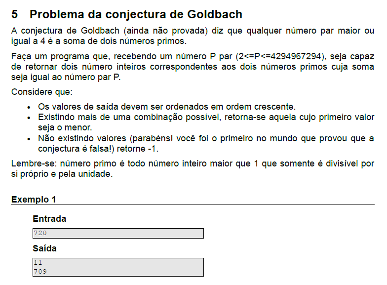

# Conjectura de Goldbach

- Em 7 de junho de 1742, um matemático prussiano chamado Christian Goldbach escreveu uma carta ao suíço Leonhard Euler, um dos mais proeminentes matemáticos do século XVIII e de todos os tempos, onde ele propôs a seguinte conjetura:

- “Todo inteiro par maior que 2 pode ser escrito como a soma de 2 números primos.”

- Em linguagem matemática:
2k = p + q , onde p e q são números primos e k é um número inteiro positivo maior do que um.

- Apesar de parecer simples, a Conjectura de Goldbach é um dos problemas mais antigos não resolvidos da matemática na área de teoria dos números, que é, a grosso modo, o ramo da matemática pura que estuda propriedades dos números em geral, e em particular dos números inteiros. 
Verificações por computador já confirmaram a conjetura de Goldbach para muitos números. No entanto, a efetiva demonstração matemática ainda não ocorreu.

## PROBLEMA:

